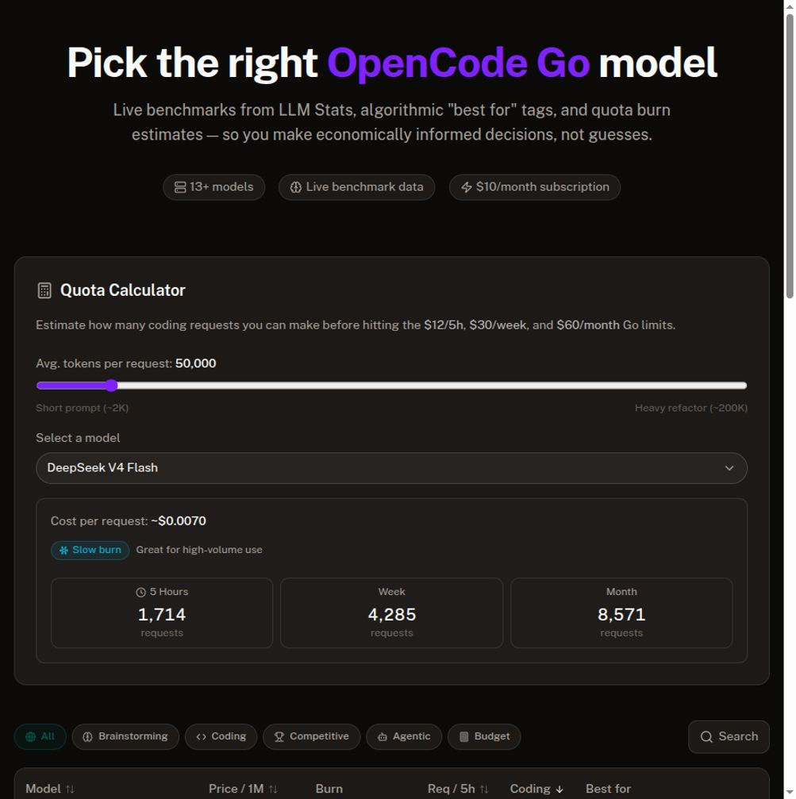

# 🔥 ZenPick

**Find the right OpenCode Go model — without burning through your quota.**

[](https://app.netlify.com/projects/zenpick/deploys)

[ZenPick](https://zenpick.netlify.app) compares every [OpenCode Go](https://opencode.ai/zen) model side-by-side with live benchmarks, algorithmic fit scores, and quota burn estimates. One $10/month subscription, 12+ models — pick the one that matches your task and your budget.



---

## Why ZenPick

OpenCode Go gives you a single API key to 12+ curated coding models. But which one do you actually use? Some burn through your $60 monthly quota in hours; others last all month. Some are built for competitive programming, others for long-context agentic work.

ZenPick answers three questions:

1. **Which model fits my task?** — Scenario scores rank every model for Brainstorming, Coding, Competitive, Agentic, and Budget use cases.
2. **How fast will it burn my quota?** — Thermal burn badges and request-per-window estimates show you the economics at a glance.
3. **What closed-source model does it replace?** — Migration hints map each Go model to its frontier equivalent (e.g. "if you used Claude Sonnet 4.6, try DeepSeek V4 Pro").

---

## Features

- **🎯 Scenario filters** — Every model gets a 0–100 fit score per scenario. No empty tables, no brittle tag matching.
- **📊 Sortable table** — Compare by benchmark scores, pricing, quota requests, or scenario fit.
- **🔥 Thermal burn badges** — ❄️ Quota-friendly (cyan) · 🌡️ Moderate (amber) · 🔥 Burns fast (red)
- **🖥️ Detail drawer** — Per-model deep dive: pricing, quota estimates, benchmark bars, migration hints, one-tap copy model ID.
- **🧮 Quota calculator** — Slider to estimate token usage and cost-per-request against your Go subscription.
- **⚡ Live data** — Fetches from [LLM Stats](https://llm-stats.com) and [OpenCode Go](https://opencode.ai/docs/go/). Cached for 6 hours with stale-while-revalidate.

---

## Tech Stack

| Layer      | Technology                                                                  |
| ---------- | --------------------------------------------------------------------------- |
| Framework  | [Svelte 5](https://svelte.dev) + [SvelteKit](https://kit.svelte.dev)        |
| Styling    | [Tailwind CSS v4](https://tailwindcss.com)                                  |
| Components | [shadcn-svelte](https://shadcn-svelte.com) + [Bits UI](https://bits-ui.com) |
| Icons      | [Lucide](https://lucide.dev)                                                |
| Data       | LLM Stats API + OpenCode Go `/models` endpoint                              |
| Runtime    | [Bun](https://bun.sh)                                                       |
| Deployment | [Netlify](https://netlify.com)                                              |

---

## Getting Started

```bash
# Clone
git clone https://github.com/Michael-Obele/zenpick.git
cd zenpick

# Install dependencies
bun install

# Set up environment
cp .env.example .env
# Add your LLM_STATS_API_KEY and API_KEY to .env

# Start dev server
bun run dev
```

Open [http://localhost:5173](http://localhost:5173) in your browser.

---

## Project Structure

```
src/
  lib/
    types/models.ts           — Shared type definitions
    server/
      llm-stats.ts            — LLM Stats API client
      opencode-go.ts          — OpenCode Go /models endpoint
      inference.ts            — Algorithmic tag & scenario scoring
    cache.ts                  — In-memory TTL cache (6h)
    burn.ts                   — Burn rate tier calculations
    remote/
      models.remote.ts        — getModels() query
    components/
      FilterBar.svelte        — Scenario pills + search
      ModelTable.svelte       — Sortable/filterable model table
      ModelDrawer.svelte      — Detail panel with migration hints
      QuotaCalculator.svelte  — Token → quota estimator
      ui/                     — shadcn-svelte primitives
  routes/
    +page.svelte              — Single-page app
    layout.css                — Global styles
static/
  screenshot.png              — README screenshot
docs/
  plans/                      — Design docs
```

---

## Design Docs

- [Architecture & Data Flow](docs/plans/2026-07-04-opencode-compare-design.md)
- [UI Redesign — Thermal Metaphor](docs/plans/2026-07-05-opencode-compare-ui-design.md)
- [Implementation Plan](docs/superpowers/plans/2026-07-05-opencode-compare-ui-implementation.md)

---

## License

MIT
