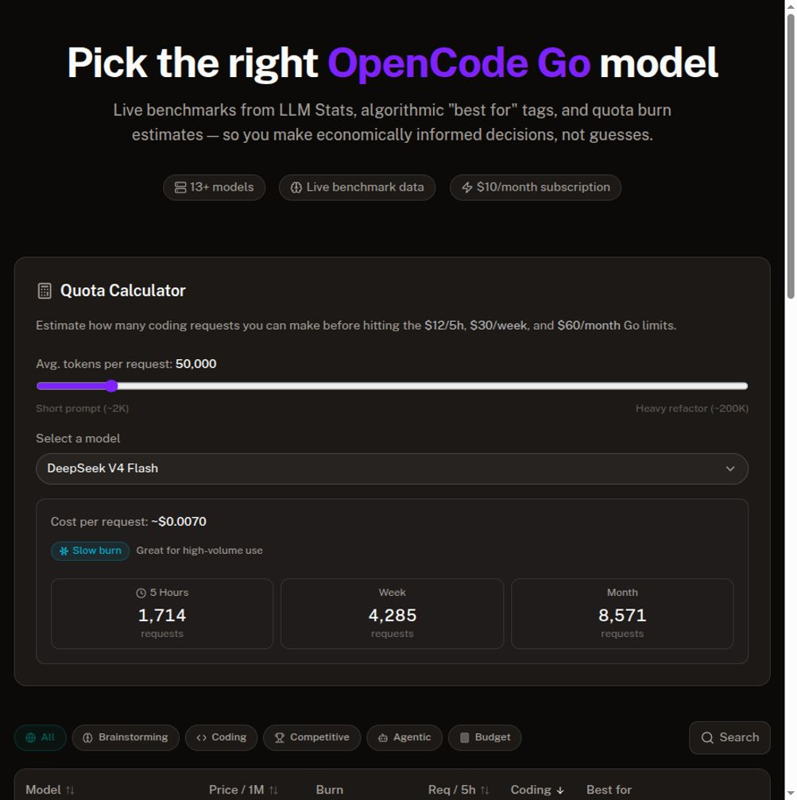

# 🔥 ZenPick

**Find the right OpenCode Go model — without burning through your quota.**

[](https://app.netlify.com/projects/zenpick/deploys)

[ZenPick](https://zp.svelte-apps.me/) compares every [OpenCode Go](https://opencode.ai/go) model side-by-side with live benchmarks, algorithmic fit scores, and quota burn estimates. One $10/month subscription, 13+ models — pick the one that matches your task and your budget.

👉 [zp.svelte-apps.me](https://zp.svelte-apps.me/) · [github.com/Michael-Obele/zenpick](https://github.com/Michael-Obele/zenpick)



---

## Why ZenPick

OpenCode Go gives you a single API key to 12+ curated coding models. But which one do you actually use? Some burn through your $60 monthly quota in hours; others last all month. Some are built for frontend UI work, others for long-context agentic work.

ZenPick answers three questions:

1. **Which model fits my task?** — Scenario scores rank every model for Brainstorming, Coding, Agentic, Budget, and Frontend UI use cases.
2. **How fast will it burn my quota?** — Thermal burn badges and request-per-window estimates show you the economics at a glance.
3. **What closed-source model does it replace?** — Migration hints map each Go model to its frontier equivalent (e.g. "if you used Claude Sonnet 4.6, try DeepSeek V4 Pro").

---

## Features

- **🎯 Scenario filters** — Every model gets a 0–100 fit score per scenario. No empty tables, no brittle tag matching.
- **📊 Sortable table** — Compare by benchmark scores, pricing, quota requests, or scenario fit.
- **🔥 Thermal burn badges** — ❄️ Quota-friendly (cyan) · 🌡️ Moderate (amber) · 🔥 Burns fast (red)
- **🖥️ Detail drawer** — Per-model deep dive: pricing, quota estimates, benchmark bars, migration hints, one-tap copy model ID.
- **🧮 Quota calculator** — Slider to estimate token usage and cost-per-request against your Go subscription.
- **⚡ Live data** — Fetches from [modelgrep](https://modelgrep.com) (OpenRouter pricing + Artificial Analysis benchmarks) and [OpenCode Go](https://opencode.ai/docs/go/). Cached for 6 hours with stale-while-revalidate.

---

## Tech Stack

| Layer      | Technology                                                                  |
| ---------- | --------------------------------------------------------------------------- |
| Framework  | [Svelte 5](https://svelte.dev) + [SvelteKit](https://kit.svelte.dev)        |
| Styling    | [Tailwind CSS v4](https://tailwindcss.com)                                  |
| Components | [shadcn-svelte](https://shadcn-svelte.com) + [Bits UI](https://bits-ui.com) |
| Icons      | [Lucide](https://lucide.dev)                                                |
| Data       | modelgrep API + OpenCode Go `/models` endpoint                              |
| Runtime    | [Bun](https://bun.sh)                                                       |
| Deployment | [Netlify](https://netlify.com)                                              |

---

## Getting Started

```bash
# Clone
git clone https://github.com/Michael-Obele/zenpick.git
cd zenpick

# Install dependencies
bun install

# Set up environment
cp .env.example .env
# No API keys needed — modelgrep is free and open

# Start dev server
bun run dev
```

Open [http://localhost:5173](http://localhost:5173) in your browser.

---

## Project Structure

```
src/
  lib/
    types/models.ts           — Shared type definitions
    server/
      modelgrep.ts            — modelgrep API client
      opencode-go.ts          — OpenCode Go /models endpoint
      inference.ts            — Algorithmic tag & scenario scoring
    cache.ts                  — In-memory TTL cache (6h)
    burn.ts                   — Burn rate tier calculations
    remote/
      models.remote.ts        — getModels() query
    components/
      FilterBar.svelte        — Scenario pills + search
      ModelTable.svelte       — Sortable/filterable model table
      ModelDrawer.svelte      — Detail panel with migration hints
      QuotaCalculator.svelte  — Token → quota estimator
      ui/                     — shadcn-svelte primitives
  routes/
    +page.svelte              — Single-page app
    layout.css                — Global styles
static/
  screenshot.png              — README screenshot
docs/
  plans/                      — Design docs
```

---

## Design Docs

- [Architecture & Data Flow](docs/plans/2026-07-04-opencode-compare-design.md)
- [UI Redesign — Thermal Metaphor](docs/plans/2026-07-05-opencode-compare-ui-design.md)
- [Implementation Plan](docs/superpowers/plans/2026-07-05-opencode-compare-ui-implementation.md)

---

## AI & LLM consumption

Because the catalog is rendered client-side, LLM crawlers that cannot run JavaScript would see an empty page. ZenPick therefore serves a dynamically generated **[`/llms.txt`](https://zp.svelte-apps.me/llms.txt)** (the [llmstxt.org](https://llmstxt.org) convention): the live model catalog as plain markdown, generated on request from the same server-side cache the app uses.

- Route: `src/routes/llms.txt/+server.ts` (a `+server.ts` route, the same pattern as a `/sitemap.xml`).
- Content: summary, the full model table (pricing, burn, quota, fit scores, migration hints, per-model llm-stats link), key pages, and data sources.
- Caching: `Cache-Control: public, max-age=600` on top of the 6h in-memory model cache.

---

## Refreshing model data in production

Model data is cached **in-process** (`src/lib/cache.ts`) with a 6h TTL and stale-while-revalidate: a stale request returns the old data immediately and refreshes in the background. That means new upstream models appear automatically within ~6h + one request — but sometimes you want them _now_.

For that there is a secret-protected endpoint:

```bash
curl -X POST https://zp.svelte-apps.me/api/revalidate \
  -H "Authorization: Bearer $REVALIDATE_SECRET"
# → { "ok": true, "models": 32, "durationMs": 1234, "at": "..." }
```

`POST /api/revalidate` forces a fresh upstream fetch (bypassing the TTL) and rebuilds both the model cache and the frontier snapshot. Point a Netlify build hook, a scheduled GitHub Action, or a manual `curl` at it.

- **Setup**: set `REVALIDATE_SECRET` (any long random string) in your local `.env` **and** in the Netlify environment. If it is unset the endpoint returns `500`; a wrong/missing token returns `401`.
- **Effect**: only the instance that handles the request is invalidated (the cache is per-instance memory). On a single warm serverless instance that is the whole app; with multiple instances the rest converge as their own TTLs lapse. Making it global would require a shared cache (Netlify Blobs / KV / Redis).
- **Client pages**: an already-open tab keeps its current data until reload or navigation. A fresh page load (or `getModels().refresh()`) picks up the rebuilt cache.

---

## License

MIT
